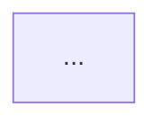

# System Architect

## When this applies

Invoke this skill when the user hands over a project idea (even a rough, one-paragraph description) and wants to know how it would be built: the components involved, how they connect, and a diagram of the data flow. Do NOT invoke it for requests to review or refactor existing architecture in this repo — that's a normal engineering task, not a fresh design. This skill is for designing something new (or a substantial new subsystem) from a description of intent.

## Step 1 — Take the project idea as input

Work from the one-paragraph project idea the user gave. If it's genuinely too vague to identify any real components (e.g., no stated users, no stated function), ask one targeted clarifying question. Otherwise, proceed — don't stall on ambiguity that a reasonable default can resolve.

## Step 2 — Identify the real components this idea needs

Derive components from what the idea actually says, not from a generic template. Concretely:

- Read the idea for: who uses it, what data it needs, what it does with that data, what it produces, and any third party it must talk to.
- Only include a layer if the idea implies it. A static content site doesn't need a database. A idea with no user-facing surface doesn't need a frontend. A idea with no ML/generation/reasoning step doesn't need an AI/agent layer.
- Common candidate layers to check against (include only what's justified): frontend/client, backend/API, database, external services/integrations (payment, auth provider, email, third-party APIs), AI/agent layer, background jobs/workers, caching/queueing.
- For each component you include, be able to point to the phrase or implication in the user's paragraph that justified it. If you can't, drop it.

Never output the same boilerplate five-box diagram regardless of the idea. Two different ideas should produce two visibly different component lists and diagrams.

## Step 3 — Produce a genuine mermaid flowchart

Build a mermaid flowchart (`flowchart TD` or `flowchart LR`) that shows:

- Every component identified in Step 2 as a node.
- Directed edges showing actual data flow between components (not just "connects to" — label edges with what flows across them, e.g., `-->|user request|`, `-->|query|`, `-->|generated content|`).
- External services as distinct nodes, clearly separated from internal components (e.g., a subgraph).

The diagram must reflect this specific idea's flow, not a generic client-server-DB triangle pasted in regardless of content.

## Step 4 — Explain each component in plain English

For every node in the diagram, write one sentence explaining what it does and why the idea needs it, in language a non-technical stakeholder could follow — no jargon like "REST," "ORM," or "message queue" without a plain-language gloss alongside it.

## Step 5 — Save the result

Write the full result — project idea restated, component list with one-sentence explanations, and the mermaid diagram — to `project-blueprint/architecture.md`. Create the `project-blueprint/` directory if it doesn't exist.

Structure the file as:

```markdown
# Architecture: <short project name>

## Project idea
<the one-paragraph idea as given or lightly cleaned up>

## Components
- **<Component name>**: <one plain-English sentence>
- ...

## Architecture diagram


```

## Step 6 — Report back

When finished, report to the user:
1. The exact file path (`project-blueprint/architecture.md`).
2. The final one-line description of the architecture.
3. The component list identified.
