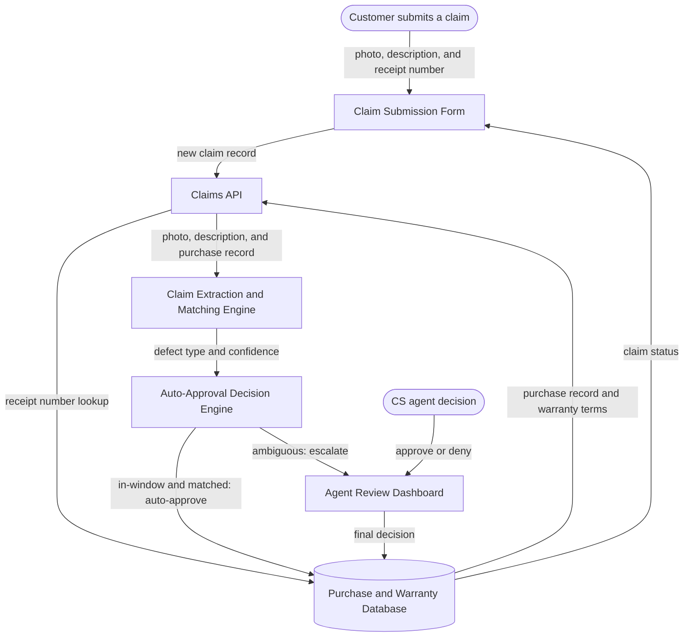

# Architecture: Warranty Claim Triage

## The Idea

For the two-person customer service team at a regional appliance retailer who currently eyeball every warranty claim by hand. A customer submits a claim through a simple form — what broke, when, a photo, and their receipt/order number. The system pulls up that customer's purchase record and the manufacturer's warranty terms, and auto-approves the claim only when it's unambiguous (in-window, matching purchase, matching defect type); anything else — no purchase match, borderline dates, unclear damage from the photo — gets routed to a human queue instead of guessing.

**The one thing it must do well on day one:** never auto-approve a claim that falls outside the warranty window or has no matching purchase record — a false approve costs real money, so the system should be biased toward "ask a human" over "guess yes." The **Auto-Approval Decision Engine** exists specifically to guarantee this.

## Components

| Component | What it does for this project | Words that required it |
|---|---|---|
| **Claim Submission Form** | The page a customer uses to submit what broke, when, a photo, and their receipt number — and later check their claim status. | "A customer submits a claim through a simple form" |
| **Claims API** | Receives a new claim, looks up the matching purchase record, and coordinates the rest of the pipeline. | "The system pulls up that customer's purchase record" |
| **Purchase and Warranty Database** | Stores every customer purchase, every manufacturer's warranty terms, and every claim decision, so nothing is re-entered or forgotten between visits. | "purchase record and the manufacturer's warranty terms" |
| **Claim Extraction and Matching Engine** | Reads the photo and free-text description of the damage and figures out what kind of defect is being claimed, so the decision engine has something concrete to check. | "what broke... a photo", "matching defect type" |
| **Auto-Approval Decision Engine** | The single place that decides approve-automatically versus ask-a-human — and only approves automatically when the claim is unambiguous on every count. This is the component that guarantees the day-one requirement. | "auto-approves the claim only when it's unambiguous" |
| **Agent Review Dashboard** | Where the two-person customer service team reviews every claim the Decision Engine wasn't sure about, with the same evidence the engine saw. | "gets routed to a human queue instead of guessing" |

**Deliberately not included:** a job queue / message broker. Claims trickle in one at a time for a two-person team — there's no burst to smooth out, so a queue would be padding, not architecture. (Revisit if volume changes — see Assumptions and the Open Question.)

## How It Fits Together

## Data Flow

1. A customer fills out the **Claim Submission Form** with what broke, when, a photo, and their receipt/order number.
2. The **Claims API** receives the new claim and looks up the customer's purchase record and applicable warranty terms in the **Purchase and Warranty Database** using the receipt/order number.
3. The **Claims API** sends the claim's photo, free-text description, and the matched (or unmatched) purchase record to the **Claim Extraction and Matching Engine**.
4. The **Matching Engine** extracts a defect type and a confidence score from the photo and description, and checks it against the warranty terms' covered-defect list.
5. The **Auto-Approval Decision Engine** applies three deterministic checks: is the claim inside the warranty window, is there a matching purchase record, and does the defect type match a covered defect. **All three must pass.**
6. If all three checks pass, the claim is auto-approved and the decision, with its reasoning, is written to the **Purchase and Warranty Database**.
7. If any single check fails or is inconclusive (no purchase match, borderline date, unclear photo), the claim is routed to the **Agent Review Dashboard** instead of being auto-approved *or* auto-denied.
8. A CS agent reviews the claim on the dashboard, sees the same evidence the engine saw plus the reason it was flagged, and makes the final approve/deny call.
9. The final decision is written back to the **Purchase and Warranty Database**, and the customer can see the claim status when they return to the **Claim Submission Form**.

## Build Order

1. **Data spine** — Purchase and Warranty Database + Claims API, fed by a bare-bones internal claim-entry form. *Proves:* a claim can be submitted, stored, and correctly matched to a purchase record before any automation exists.
2. **Auto-Approval Decision Engine (make-or-break)** — the three deterministic checks, run against hand-picked test claims, not yet AI-extracted ones. *Proves:* the system never auto-approves an out-of-window or unmatched claim — the entire point of the project.
3. **Agent Review Dashboard** — *Proves:* a human can see an escalated claim with its evidence and reasoning, and record a final decision.
4. **Claim Extraction and Matching Engine** — *Proves:* real photos and free-text descriptions can be turned into the structured defect type the Decision Engine needs.
5. **Customer-facing Claim Submission Form** — replaces the bare-bones internal one, adds status lookup. *Proves:* the whole loop works end-to-end for a real customer, not just internally.

## Assumptions

| Assumption | Impact if wrong |
|---|---|
| Manufacturer warranty terms are imported into our own database periodically (e.g., a weekly import), not queried live from each manufacturer's system. | Keeps the Decision Engine fast and offline-capable, but terms can go stale between imports — a manufacturer's policy change won't be reflected until the next import. |
| Claim volume is low enough (a handful per day, matching a two-person team) that no background queue or async processing is needed — claims are handled synchronously. | Much simpler system; if volume grows into the hundreds per day, photo analysis may need to move to an async job so the submission form doesn't hang. |
| "Unclear damage from a photo" can be detected as a low-confidence score from the Matching Engine, rather than requiring a separate human-in-the-loop photo-quality gate. | Simpler pipeline, but a genuinely bad photo (blurry, wrong item) might get a false medium-confidence score instead of being bounced back to the customer for a better one. |
| One shared queue serves both CS team members with no claim-assignment logic (first-to-open-it takes it). | Fine at two people; would need real assignment/locking logic before adding a third reviewer, to avoid two agents working the same claim at once. |

## Open Question

**Does the Matching Engine need to actually analyze the photo (computer vision), or is the claim's text description enough to extract the defect type?**

- **If text is enough:** the Matching Engine is a text-extraction/classification step only — cheaper, faster, no image model needed. Photos are stored as supporting evidence for the human reviewer, not analyzed automatically. "Unclear damage from the photo" becomes a human-review trigger, not something the engine detects on its own.
- **If the photo must be analyzed:** the Matching Engine needs a vision-capable model, raising both cost and latency per claim. Confidence scoring needs to combine text and image signals, complicating the Decision Engine's three checks. Photo quality (blur, wrong angle) becomes its own failure mode the engine must detect and route to a human.

## What This Design Does Not Cover

- Notifying the customer proactively (email/SMS) when a decision is made — today the customer must return to the status page to check.
- Disputes — what happens when a customer disagrees with a denial. That's a follow-on workflow, not this design.
- Fraud patterns across claims (e.g., the same photo submitted by different accounts) — each claim is evaluated independently.
- Onboarding a new manufacturer's warranty-terms format — today's import assumes a consistent terms structure; an unusual policy format needs manual mapping first.
